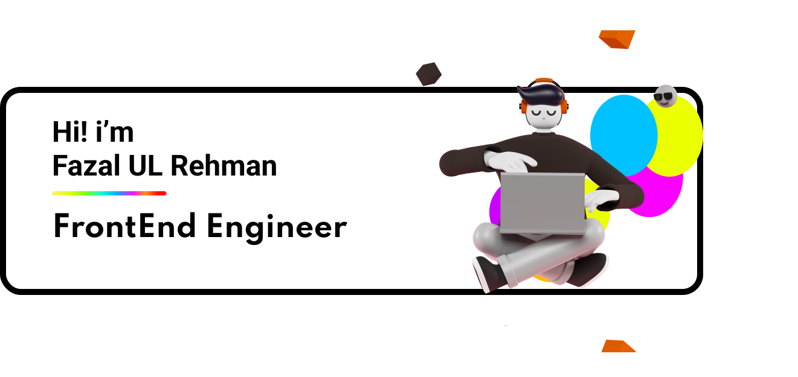

<h2 align="left">Technologies</h2>

<p align="left">
    
    
    
    
    
    
    
    
    
    
    

</p>

<h2 align="left">More Tools</h2>
<p align="left">
    
    
    
     -
    
    


</p>

<h2 align="left">RoadMaps Follow</h2>
<p align="left">

<!-- [](https://roadmap.sh) -->
</p>

<h2 align="left">Statistics</h2>

<p align="left">

<!-- [](https://roadmap.sh) -->
</p>

<h2>Total Repositories</h2>
<p align="left"> 
<picture>
  <source media="(prefers-color-scheme: dark)" srcset="https://raw.githubusercontent.com/FrontEndProfile/FrontEndProfile/output/github-contribution-grid-snake-dark.svg">
  <source media="(prefers-color-scheme: light)" srcset="https://raw.githubusercontent.com/FrontEndProfile/FrontEndProfile/output/github-contribution-grid-snake.svg">
  
</picture>
<!--      -->
</p>

<h2>Portfolio</h2>

```bash
  https://FrontEndProfile.com
```

<h2 align=left>Profile Visit Success</h2>
<p align="left">
  
</p>
